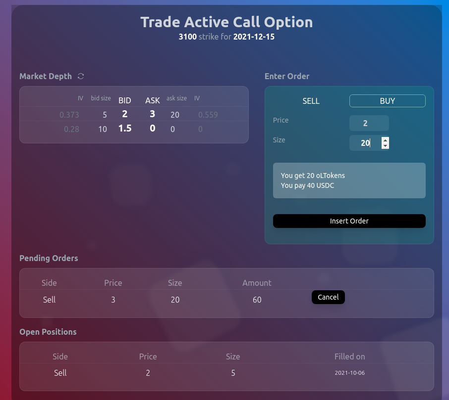

# NervOpt (nervos-hackathon-2)

Nervopt allows the trading of call options on ckETH. The contract has one active call option at each moment, with fixed expiries on the 15th of March, June, September and December. Each strike will be set as the spot price 115% on the expiry of the previous option.

All options are cash settled in ckDAI and the collateral amount is also kept in ckDAI



## Contracts

```
cd client
node scripts/deploy.js
```

Change address in 'client/src/constants/tradeContract.js' to the address returned for the script as "Deployed Options contract address"

### Deployed Contracts

Trade Factory: 0x3F79EB0DF648E822E50388bf546F611032f17339

Active Option: 0x33450Be58beF2FdB5eff6c6D59fFE6231B5b2c86

## Frontend

Live Frontend: http://nervos.nhag.ga

https://youtu.be/PwzAwpN63-s

### Project setup

```
cd client

yarn install
```

### Compiles and hot-reloads for development

```
yarn serve
```

### Compiles and minifies for production

```
yarn build
```
